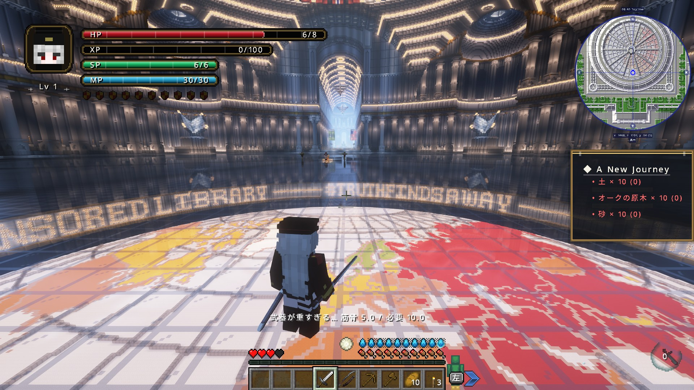
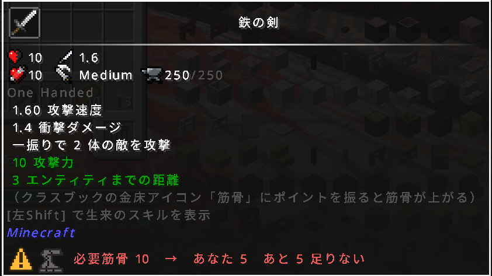
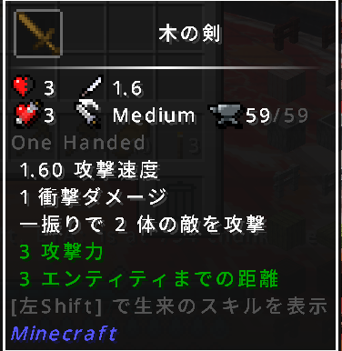
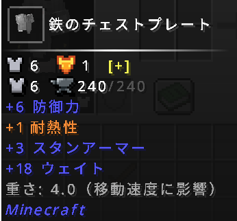
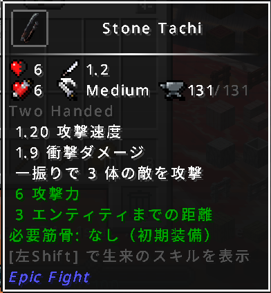
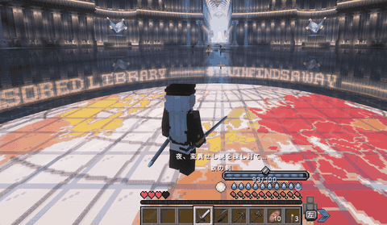
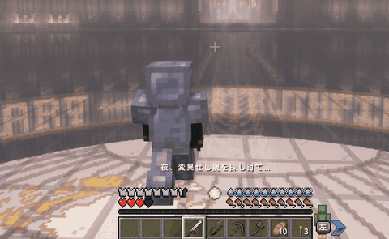

# fc8weight

Minecraft Forge 1.20.1 / EpicFight 連携の**重量・筋力ゲート mod**。
「拾った装備は誰でもすぐ振れる」を壊し、キャラクターの成長に意味を持たせる。

約270modの個人運用サーバーで実際に稼働させながら作った。
設計判断の全記録は [docs/DESIGN_LOG.md](docs/DESIGN_LOG.md) にある。



*筋骨5のキャラクターが鉄の剣（要求10）を振ろうとした場面。攻撃は発生せず、`武器が重すぎる… 筋骨 5.0 / 必要 10.0` が表示される。*

---

## 中心にある1つの数値

武器ごとに **必要筋骨** を決め、そこから3つの挙動を導く。

```
必要筋骨 = 素材の剣基準値 + (サイズ値 − 軽の値) × 素材の倍率
```

| 素材 | 剣基準値 | 倍率 | 軽（剣） | 中（太刀・斧・槍） | 重（大剣・大槌） |
|---|---|---|---|---|---|
| 木・石・革 | 0 | — | 0 | 0 | 0 |
| 鉄・鋼・銅・銀 | 10 | ×1 | 10 | 12 | 16 |
| 金 | 20 | ×1 | 20 | 22 | 26 |
| ダイヤ・エメラルド | 50 | ×2 | 50 | 54 | 62 |
| ネザライト | 100 | ×3 | 100 | 106 | 118 |

バニラの鉄の剣がちょうど 10 になるよう全体を組んである。この1本の梯子から、

- **装備できるか** — 筋骨が足りなければ EpicFight の通常攻撃がキャンセルされる
- **攻撃力** — 必要筋骨 × 0.5 が武器のダメージに加算される（鉄の剣なら +5）
- **移動速度** — 装備の合計重量が、振った筋力の許容量を超えた分だけ遅くなる

の3つが決まる。防具は「剣基準値 × 部位係数」で、**フルセットがちょうどその素材の剣と同じ重さ**になる（鉄10・ダイヤ50・ネザライト100）。

初期キャラは木と石しか装備できない。これは仕様であって不便ではない — **装備できないからこそ、筋力に振る意味が生まれる。**

### 画面での見え方

同じ鉄の剣が、筋骨を満たす前と後でこう変わる。

**足りないとき**（筋骨5・要求10）



**足りたとき**（筋骨15・要求10）


不足しているあいだは、アイコンと文字がゆっくり赤く明滅する。


数値を読まなくても状態が分かるよう、**⚠️バッジ・金床のひび割れ・赤い明滅の3つを同時に**出している。
足りていれば ⚠️ は消え、金床のひびも塞がり、明滅も止まる。

以前は `必要筋骨: 10.1 / あなたの筋骨: 3.0` と1行で書いていたが、**スラッシュが割り算に読まれた**ため作り直した。
（10人ほどに遊んでもらい、配信を見ていて誤読に気づいた）

| 木の剣（要求0） | 防具（ゲート行を持たない） | 初期装備（ゲート免除） |
|---|---|---|
|  |  |  |
| 要求0なので**アイコン行そのものが出ない**。序盤は存在すら意識させない | 防具には要求筋骨が無いので、移動速度を左右する**重さだけ**を出す | 配布される初期武器はその場で振れないと困るため、明示的に免除している |

不足時の画像で**攻撃力が10になっている**のは、要求筋骨10の半分がボーナスとして還元されているため（基礎5＋ボーナス5）。

| 防具（ゲート行を持たない） | 初期装備（ゲート免除） |
|---|---|
|  |  |
| 防具には要求筋骨が無いので、移動速度を左右する**重さだけ**を出す | 配布される初期武器はその場で振れないと困るため、明示的に免除している |

### 移動を重くしているのは、罰のためではない

このmodには移動速度ペナルティが6系統ある。厳しく見えるが、目的は**プレイヤーを戦闘システムに向き合わせること**にある。

EpicFight は攻撃モーションに硬直がある戦闘modで、**速く動けてしまうとプレイヤーは逃げ回って戦闘そのものを回避でき、モーションを覚えないまま進んでしまう。**
移動を重くすると、逃げるより「モーションを覚えて捌く」ほうが合理的になる。

重さの表現であると同時に、**戦い方を学ばせるための誘導**として設計している。

実際に効いていることは属性値で確認している。


バニラの基準値 0.1 に対して **0.0266**（約26%）。装備を積むほどこの値が下がる。

---

## 設計判断 ①  既知はゲームの論理、未知は物理の論理

最初は「**Weight = 現実の素材密度 × 武器のサイズ**」というモデルだった。
金は現実で鉄より重い（19.3 vs 7.9）から密度24、ダイヤは石と大差ないから密度4。
物理的には正しく、「重いのに弱い金の武器」という現実の皮肉もそのまま表現できていた。

**だがゲームの進行度と真逆を向いていた。**

| | 密度モデル | 求めたい姿 |
|---|---|---|
| 金の剣 | 重さ14.4（全武器で最重） | 序盤の装備 |
| ダイヤの剣 | 重さ2.4（羽のように軽い） | 終盤の装備 |

現実の比重とゲーム進行度は、そもそも両立しない2本の軸だった。ゲームである以上、進行度を採った。

**ただし密度モデルは消していない。フォールバックへ降格させた。**

```
1. ティア表        → 知っている素材は、ゲームの進行度で値付けする
2. 密度 × サイズ   → 知らない素材は、現実の物理で値付けする
3. 攻撃力 × 係数   → それでも分からなければ、強さから逆算する
```

約270modの環境では、こちらが知らない武器に必ず出会う。そのとき何を頼りにするか。
答えは現実の比重だった。**ゲーム独自の階層は知っている物にしか使えないが、物理法則は初対面の物にも適用できる。**

`simplyswords:mithril_longsword` のような素直な命名は第2段が拾い、それすら解決できなければ第3段が必ず何らかの値を返す。**未知の入力で例外を投げず、精度を段階的に落として必ず答える。**

---

## 設計判断 ②  演算子の選択が、そのままバランス設計になっている

移動速度ペナルティは `MULTIPLY_TOTAL`（乗算）で適用している。減算ではない。

このmodが動く環境では、移動速度を数百%積む手段が複数ある。
**減算ペナルティなら、バフを積むだけで無効化できてしまう。**

乗算なら、プレイヤーがどれだけ速度を盛っても常に比例して削られる。

| 速度バフ | 重さ -99% を掛けた後 | 通常比 |
|---|---|---|
| なし | 0.001 | 1% |
| +99%（×1.99） | 0.00199 | 2% |
| +500%（×6） | 0.006 | 6% |
| **+9900%（×100）** | 0.1 | **100%** |

打ち消すには **+9900%** が必要になる。演算子をどちらにするかが、ペナルティの強度そのものを決めていた。

上限を -100% にしていない理由も同じ計算から出る。`MULTIPLY_TOTAL` の修正値が
ちょうど -1.0 だと速度が 0 に固定され、以後どんなバフも `0 × 何か = 0` で効かない。
**原理的に救出不可能な状態**を作らないため、1%だけ残している。

---

## 設計判断 ③  不変条件は、それを表現できる粒度に置く

移動速度ペナルティは6系統ある — 重量・過重量武器・所持武器ティア・バックパック過積載・防御値リニア・防具筋力ゲート。
当初はそれぞれを個別に1.0未満へクランプし、「速度は0にならない」つもりでいた。

**6つ同時に上限へ達すると、積は `0.0000084` 倍になる。**

```
0.01 × 0.70 × 0.60 × 0.10 × 0.01 × 0.20 ≒ 0.0000084
```

厳密には0ではないが、プレイ上は完全停止と区別がつかない。
**「各パーツが安全なら全体も安全」は、合成が乗算のときには成り立たない。**

per-modifier のクランプでは「積に対する上限」を表現できる場所が存在しない。
そこで6系統を先に合成し、その結果に1つだけ上限を掛ける形に変えた。
各系統の個別上限は残してある（「筋力不足のペナルティは最大30%」といった意味を持つため）。

副産物として `AttributeModifier` が6個から1個になった。

---

## 実装している機能

ゲートは表示だけでなく、実際に攻撃を止める。

| 筋骨が足りないとき | 満たしたとき |
|---|---|
|  |  |
| 振ろうとしても**攻撃が発生しない**。アクションバーに不足量が出る（1秒に1回までのスロットル付き） | 同じ武器がそのまま振れるようになる |

| 機能 | 内容 |
|---|---|
| 筋力ゲート | 筋骨不足時に EpicFight の通常攻撃をキャンセル（ソフトゲート化も可） |
| 重量エンカンブランス | 装備＋所持武器の合計重量が許容量を超えた分だけ移動速度低下 |
| 所持武器ティア別減速 | 重い武器を持っているだけで減速（重-40% / 中-25% / 軽-10%） |
| 防御値リニア減速 | 総防御力に比例した減速（Curios のアクセサリ由来防御も含む） |
| 防具筋力ゲート | 筋骨 < 総防御力 のとき固定の重い減速。「着られない防具」を表現 |
| 攻撃力ボーナス | 必要筋骨 × 0.5 を武器のダメージに加算 |
| バニラ剣の攻撃力上書き | 木3 / 石4 / 鉄5 / 金4 / ダイヤ6 / ネザライト7 を階梯の基準として固定 |
| 金防具の防御力引き上げ | 金装備が実用範囲に入るよう底上げ |
| バックパック過積載 | 所持数が閾値を超えると減速。インベントリ・エンダーチェスト・Curios・Mekanism QIO・Mekanism個人収納の**5経路**を計数 |
| weaponmaster 抜け道封鎖 | 一部mod武器が EpicFight を迂回して素の攻撃判定でダメージを通す問題を、別イベントで捕捉して塞ぐ |

掘削道具（`DiggerItem`、ただし斧を除く）は階梯から除外している。
バニラのツルハシは正の攻撃力を持つため、除外しないとダイヤのツルハシが「必要筋骨50・攻撃力30」という**誰も持てない武器**になる。詳細は [docs/DESIGN_LOG.md](docs/DESIGN_LOG.md) のバグ①。

---

## 技術的な作り

- **Mixin不使用の純イベント駆動** — EpicFight のjarを一切改変せず、Forgeイベントと EF の公開APIだけで実装。本体が更新されても壊れにくい
- **オプション依存へのソフト統合** — Mekanism / Curios / EpicClassMod はコンパイル依存ゼロ。`ModList.isLoaded` で判定し、各連携を専用クラスへ分離してあるので、未導入環境では**そのクラスが読み込まれることすらない**
- **クライアント/サーバー間の状態不一致の解消** — 筋骨の元データは専用サーバーでクライアントへ同期されない。EpicClassMod が自身のUI用に持つ同期済み状態をリフレクションで読むことで、ツールチップの表示と、サーバー側の（常に正である）判定を一致させている
- **状態を汚さない属性適用** — 毎tickの計算で付ける修正子は transient（NBTに保存されない）。5tickごとに再計算し、固定UUIDで多重適用を防ぐ
- **未知入力への段階的劣化** — 重量計算は解決失敗時に `Double.NaN` を返し、呼び出し側が次の段へ落とす（設計判断①）

---

## 技術スタック

Java 17 / Minecraft Forge 47.x (1.20.1) / EpicFight API / ForgeConfigSpec

## ビルド

EpicFight は Maven に公開されていないため、`libs/` にjarを自分で置く必要がある。

```bash
mkdir libs
# libs/ に epicfight の jar を配置（Mekanism / Curios は任意連携なので無くてもビルド可）
./gradlew build
```

生成された `build/libs/*.jar` を `mods/` へ。**EpicFight が必須**、Mekanism / Curios / EpicClassMod / Sophisticated Backpacks は任意連携。

## 設定

全挙動は `config/fc8weight-common.toml` で再コンパイル無しに調整できる。
ティア表の各基準値（`reqIronSword` 等）、サイズ加算（`reqSizeLight/Medium/Heavy`）、各ペナルティの係数と上限、連携のON/OFF がすべて設定側にある。

## フィードバック歓迎

発展途上のmodです。Issue / Discussion での指摘を歓迎します。
特に自信がないのはティア表の数値バランスと、[docs/DESIGN_LOG.md](docs/DESIGN_LOG.md) 末尾に挙げた**未検証項目**です。
